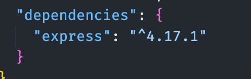
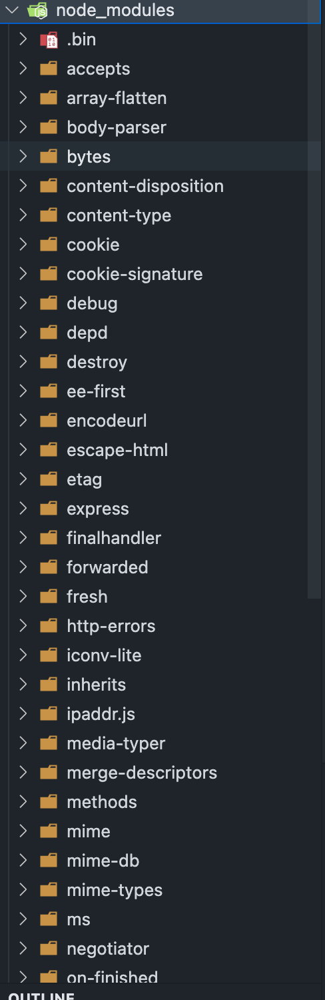
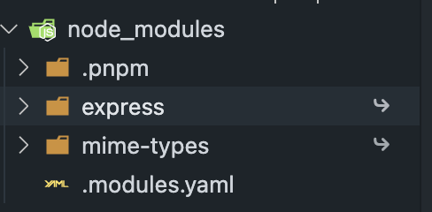
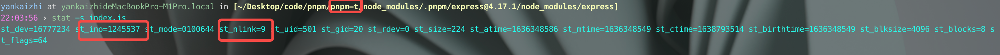
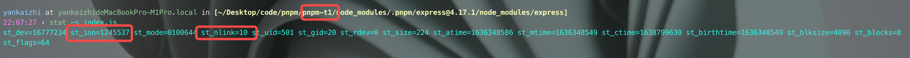

这篇文章主要讨论 pnpm 如何使用软链接和硬链接来实现对文件的复用。

## pnpm 简单介绍

[`pnpm`](https://pnpm.io/zh/)是前端项目的包管理工具，但并不是唯一的包管理工具，相同的还有 npm 和 yarn。

基本的使用

```bash
pnpm i
pnpm add module -s
...
```

## 软链接和硬链接

在讨论 pnpm 如何使用软链接和硬链接前先简单介绍一下软链接和硬链接的概念。

### 软链接

在计算机中我们文件夹中的文件实际上是一个指针，但这个指针并不是直接指向我们在磁盘中存储文件的位置，而是指向一个 inode 块，inode 中存储着文件在磁盘中的各种信息，一般我们的文件都是指向 对应文件的 inode，我们把这类链接成为硬链接，但是还有一种链接，它存储的并不是实际的值，而是另一个硬链接的地址，我们把这类链接成为软链接。


### 特性

#### 硬链接

- 具有相同 inode 节点号的多个文件互为硬链接文件；
- 删除硬链接文件或者删除源文件任意之一，文件实体并未被删除；
- 只有删除了源文件和所有对应的硬链接文件，文件实体才会被删除；
- 硬链接文件是文件的另一个入口；
- 可以通过给文件设置硬链接文件来防止重要文件被误删；
- 创建硬链接命令 ln 源文件 硬链接文件；
- 硬链接文件是普通文件，可以用 rm 删除；
- 对于静态文件（没有进程正在调用），当硬链接数为 0 时文件就被删除。注意：如果有进程正在调用，则无法删除或者即使文件名被删除但空间不会释放。

#### 软链接

- 软链接类似 windows 系统的快捷方式；
- 软链接里面存放的是源文件的路径，指向源文件；
- 删除源文件，软链接依然存在，但无法访问源文件内容；
- 软链接失效时一般是白字红底闪烁；
- 创建软链接命令 ln -s 源文件 软链接文件；
- 软链接和源文件是不同的文件，文件类型也不同，inode 号也不同；
- 软链接的文件类型是“l”，可以用 rm 删除。

## pnpm 为什么要使用软链接和硬链接

在 pnpm 出现以前，npm 和 yarn 为了提高包的复用率，都采用了扁平化的装包策略。扁平化的安装方式会导致我们的 node_modules 文件夹和 package.json 存在很大的出入。具体参考下图。

> 使用 npm 安装





可以看到我们的项目依赖中只有一个 express, 但是执行 npm i 之后 node_modules 中竟然有这么多的包，对于开发来说本身问题并不大，因为 node_modules 只是安装一次，但是 node 的寻找包的规则，这些包都是可以在项目中直接被引用的，也就是说我们在项目中引用了未在 package.json 中声明的包，这显然是不安全的，这种情况也被称为幽灵依赖。

那 pnpm 是如何解决这个问题的呢？

答案就是软链接，我们先用 pnpm 重新装一下上面的包。



可以看到 node_modules 结构非常清晰，但是这个 express 文件夹只是一个`软链接`, 它的真正存储的地方在图中的 .pnpm 文件夹中。


这样的通过软链接的设计既保证了不会出现幽灵依赖的问题，同时也能兼容 node 的寻找模块方式。

所以说 pnpm 的软链接就是将 node_modules 里的文件软链接到对应的 .pnpm/[package_name]@version/node_modules/[package_name] 中。

## pnpm 的硬链接

pnpm 有个根目录，一般都是保存在 user/.pnpm-store 下，pnpm 通过硬链接的方式保证了相同的包不会被重复下载，比如说我们已经在 repoA 中下载过一次 express@4.17.1 版本，那我们后续在 repoB 中安装 express@4.17.1 的时候是会被复用的，具体就是 repoA 中的 express 中的文件和 repoB 中的 express 中的文件指向的是同一个 inode。具体看下下面的例子：

这个是项目 pnpm-t 中 express 中的 index.js 的信息



我们可以看到当前的 index.js inode 节点为 1245537 并且有 9 个相同的硬链接

接下来我们新建 pnpm-t1 项目并安装 express

```base
mkdir pnpm-t1 && cd pnpm-t1
pnpm init -y
pnpm add express
```



可以看到 pnpm-t1 中 express 下的 index.js inode 节点仍为 1245537，并且这个文件的硬链接数量已经增加到了 10 个。也就是说 express 下的 index.js 实际上是被复用的。

## pnpm 中的问题

pnpm 的出现对于 npm 和 yarn 来说是一个比较彻底的改变，解决了很多 npm 安装依赖存在的问题，node_modules 过大、幽灵依赖。pnpm 目前存在的限制在于它修改了文件的相对位置，将包和其依赖放在同一个 node_modules 下，这让一些使用了绝对路径和幽灵依赖的包在使用 pnpm 安装时会存在问题，不过 pnpm 也在解决这个问题，即通过软链接的形式将所有**非**工程直接依赖的包放在 .pnpm/node_modules 下，这样就解决了找不到包的问题，项目在迁移 pnpm 的话尽量可能会发现 pnpm i 后还有未安装的包，这个时候就要考虑是否引用了幽灵依赖。

## 总结

pnpm 目前对于日常使用完全没问题，目前很多的类库还有框架都已经默认将 pnpm 作为安装工具，目前看来 pnpm 完全可以取代 npm。

参考

- https://xzchsia.github.io/2020/03/05/linux-hard-soft-link/
